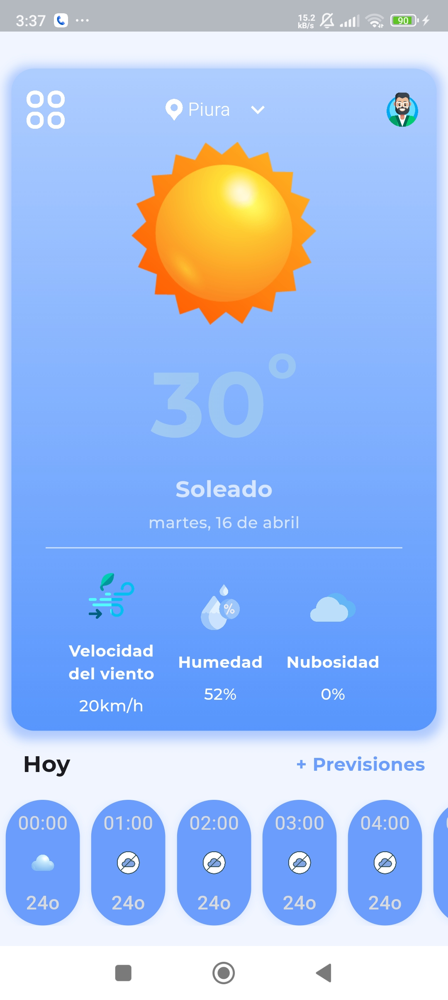
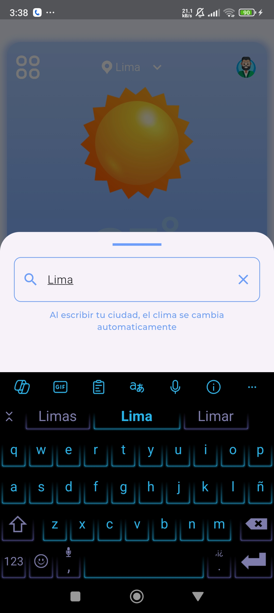
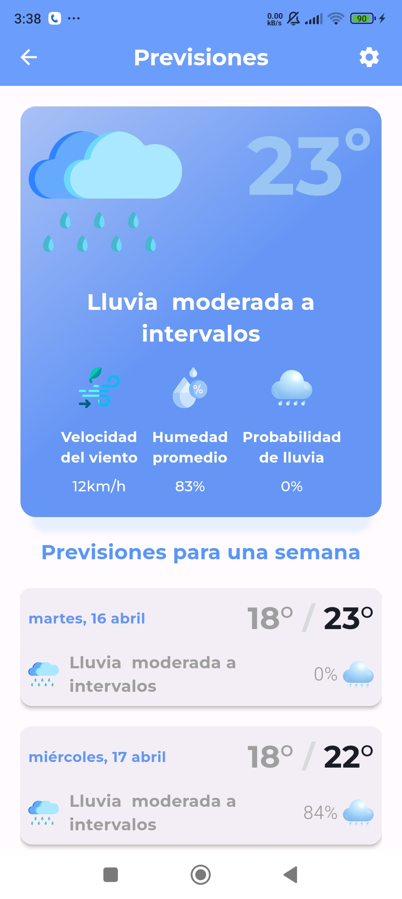

# clima_app

ClimApp es un nuevo proyecto de Flutter. Esta aplicación te permite conocer el clima actual y las predicciones para los próximos días en tu ubicación actual o en cualquier ciudad del mundo.

## Api

Se ha usado la api de https://www.weatherapi.com/ es facil de obtener una clave (Api_Key) solo registrate.

# Funciones de la app

- Muestra la una ubicación y datos reales por defecto (Puesto por el desarrollador :D).
- Puedes buscar las ciudades y paises que desees, escribiendo en el DraggableScrollableSheet.
- Puedes ver el clima de hoy 24/7.
- Puedes ver las predicciones del clima durante una semana.
- Otro dato son las imagenes que cambian segun el clima en tiempo real.

## Capturas de pantalla

A continuación, se muestran algunas capturas de pantalla de la aplicación:

| Pantalla principal | Pantalla de buscador | Pantalla de Predicciones |
|:---:|:---:|:---:|
|  |  |  |